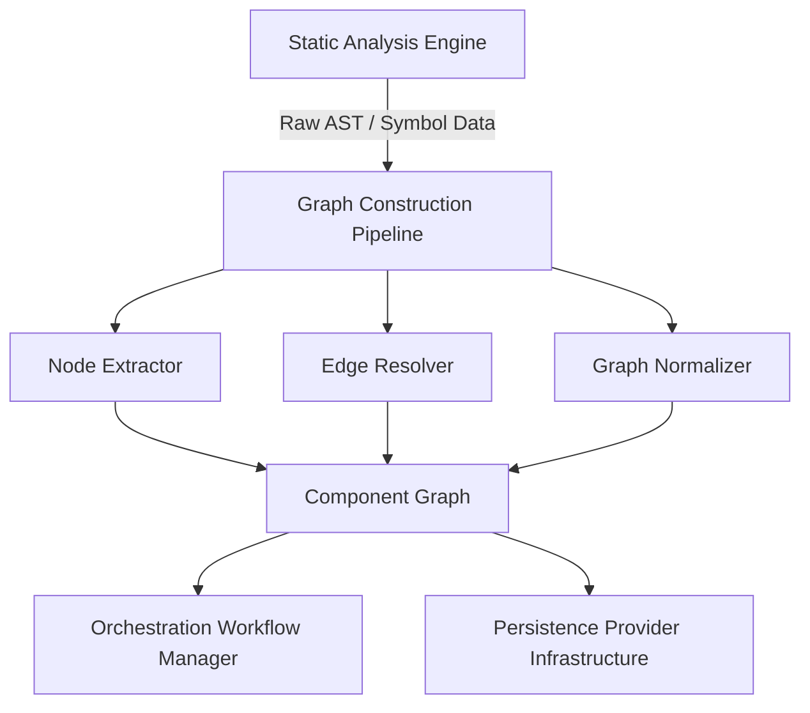

# Graph Construction Pipeline

## Overview

The Graph Construction Pipeline is responsible for transforming raw static analysis results into structured graph representations that model the relationships between code components. It serves as the bridge between the Static Analysis Engine and the higher-level orchestration and rendering layers.

## Architecture



## Components

### Node Extractor

Responsible for identifying and categorizing code entities (modules, classes, functions, variables) from the static analysis output and converting them into typed graph nodes.

**Key responsibilities:**
- Parse symbol tables produced by the Static Analysis Engine
- Assign unique identifiers to each node
- Attach metadata (file path, line range, docstring, visibility)
- Classify node types: `module`, `class`, `function`, `method`, `variable`

### Edge Resolver

Determines directed relationships between nodes based on import statements, inheritance hierarchies, function calls, and attribute access patterns.

**Edge types supported:**
| Edge Type | Description |
|-----------|-------------|
| `imports` | Module-level import dependency |
| `inherits` | Class inheritance relationship |
| `calls` | Function/method invocation |
| `uses` | Variable or attribute reference |
| `defines` | Enclosing scope definition |

**Key responsibilities:**
- Resolve cross-module references to canonical node IDs
- Detect and flag circular dependencies
- Annotate edges with call frequency or weight metadata where available

### Graph Normalizer

Post-processes the raw graph to ensure consistency, remove duplicate edges, and apply configurable filtering rules (e.g., excluding third-party library nodes).

**Key responsibilities:**
- Deduplicate parallel edges of the same type
- Apply ignore rules from `.codeboarding/.codeboardingignore`
- Prune unreachable nodes (optional, configurable)
- Validate graph integrity before handing off to consumers

## Data Model

### Node Schema

```json
{
  "id": "mypackage.utils.parse_config",
  "type": "function",
  "label": "parse_config",
  "file": "mypackage/utils.py",
  "line_start": 42,
  "line_end": 67,
  "docstring": "Parse the YAML configuration file and return a dict.",
  "visibility": "public"
}
```

### Edge Schema

```json
{
  "source": "mypackage.main.run",
  "target": "mypackage.utils.parse_config",
  "type": "calls",
  "weight": 3
}
```

### Graph Schema

```json
{
  "version": "1.0",
  "generated_at": "2024-01-15T10:30:00Z",
  "root": "mypackage",
  "nodes": [...],
  "edges": [...],
  "metadata": {
    "total_nodes": 128,
    "total_edges": 342,
    "ignored_patterns": ["tests/*", "*_pb2.py"]
  }
}
```

## Integration Points

### Input: Static Analysis Engine

The pipeline consumes the `analysis.json` artifact produced by the Static Analysis Engine. It expects the following top-level keys:
- `symbols`: flat list of all discovered symbols with their metadata
- `imports`: resolved import graph per module
- `call_graph`: raw call relationships extracted from AST traversal

### Output: Orchestration Workflow Manager

The constructed graph object is passed to the Orchestration Workflow Manager, which decides whether to persist it, diff it against a previous snapshot (Incremental Analysis Controller), or forward it directly to the Rendering Output Engine.

### Output: Persistence Provider Infrastructure

The serialized graph (JSON) is stored via the Persistence Provider Infrastructure for caching and incremental analysis support. The storage key is derived from the project root path and a content hash of the analyzed source files.

## Configuration

The pipeline behaviour can be tuned via the project's `.codeboarding/config.yaml` (when present):

```yaml
graph_construction:
  include_private_symbols: false
  max_depth: 10
  prune_unreachable: true
  edge_types:
    - imports
    - inherits
    - calls
  ignore_external_packages: true
```

## Error Handling

| Condition | Behaviour |
|-----------|-----------|
| Unresolvable import reference | Log warning, create a stub node marked `external` |
| Circular dependency detected | Log info, include cycle annotation on involved edges |
| Missing symbol metadata | Skip node with a warning; do not fail the pipeline |
| Graph validation failure | Raise `GraphIntegrityError`; abort pipeline run |

## Performance Considerations

- Node extraction and edge resolution are performed in a single pass over the symbol table to minimise memory overhead.
- For large codebases (>10k symbols), the normalizer operates in streaming mode, processing subgraphs per top-level package.
- Graph construction is fully deterministic given the same input, enabling reliable caching by the Incremental Analysis Controller.

## Related Components

- [Static Analysis Engine](./Static_Analysis_Engine.md) — upstream producer of raw analysis data
- [Incremental Analysis Controller](./Incremental_Analysis_Controller.md) — diff-based optimisation layer
- [Orchestration Workflow Manager](./Orchestration_Workflow_Manager.md) — consumer and coordinator
- [Rendering Output Engine](./Rendering_Output_Engine.md) — downstream visualisation consumer
- [Persistence Provider Infrastructure](./Persistence_Provider_Infrastructure.md) — graph storage and retrieval
